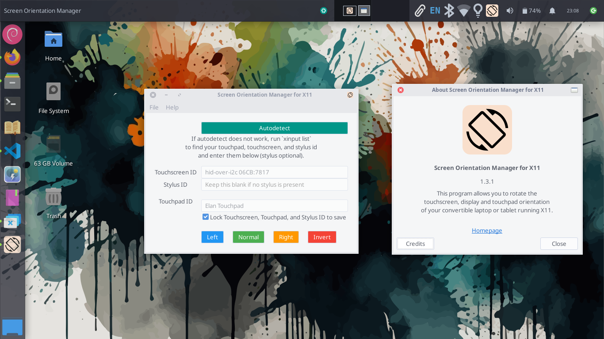
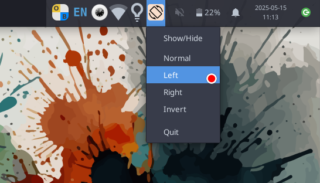

# 

## Screen Orientation Manager for touchscreen tablets and convertible laptops running GNU/Linux with X11

You can use this app to easily rotate the touchscreen input, display orientation, touchpad and stylus input in one go.

### Why?

While automatic rotation of input devices works seamlessly in GNOME and KDE on Wayland, many entry-level devices use lightweight desktop environments like XFCE, MATE, or LXDE, which rely on X11 and lack support for automatic touchscreen input rotation. As a result, when the screen is rotated, touch inputs can become misaligned (e.g., after rotating the screen, touching the top-left corner might register as a tap in the bottom-right). This app resolves that issue. It also runs in the system tray, making it easy to access when using the device in tablet mode.

If you want us to add autodetect support for your device, please open an issue in [GitHub issues](https://github.com/archisman-panigrahi/surface-RT-screen-rotator/issues).




Based on [theGeekyLad/GtkExperiments](https://github.com/theGeekyLad/GtkExperiments)

**Note**: You need to be on an **Xorg** session for this app to work. **Wayland isn't supported** at the moment. DEs which support Wayland, such as GNOME or KDE have inbuilt support for gyroscope based display and touch input orientation, so Wayland-support is currently of low priority.

### Installation

#### Raspberry Pi OS/Debian/Ubuntu

Download the prebuilt .deb package from [GitHub Releases](https://github.com/archisman-panigrahi/surface-RT-screen-rotator/releases/), and install it with

```
sudo apt install /path/to/downloaded_installer.deb
```
Or use a graphical installer like GDebi to install the .deb file.

In Ubuntu, you can use the [official PPA](https://code.launchpad.net/~apandada1/+archive/ubuntu/screen-orientation-manager)

```
sudo add-apt-repository ppa:apandada1/screen-orientation-manager
sudo apt update
sudo screen-orientation-manager
```

#### Arch Linux

You can get it from the [AUR](https://aur.archlinux.org/packages/screen-orientation-manager-git)
```
yay -S screen-orientation-manager-git
```

#### PostmarketOS

Since `meson` is not available on PostmarketOS, you can use the bash script installer instead.
```
git clone https://github.com/archisman-panigrahi/surface-RT-screen-rotator.git
cd surface-RT-screen-rotator
chmod +x alternate-install.sh
sudo bash alternate-install.sh
```
Note that if you use this procedure, you have to manually uninstall the app by removing the files.

#### Other operating systems

This project uses the Meson build system for configuration and installation.
Build Instructions:

- Ensure you have Meson and Ninja installed on your system.
- Install gtk3
- Navigate to the project directory.
- Run the following commands to build and install the application:
```
meson setup builddir --prefix=/usr
sudo meson install -C builddir
```
To uninstall, run
```
sudo meson uninstall -C builddir
```
Running the Application

After installation, you can run the application using:
```
screen-orientation-manager
```

### Different device?

By default, the app uses the touchscreen and touchpad ID for Lenovo Chromebook 300e (HANA).
If you are using a different device, you can find the touchscreen name by running the command `xinput list`. Then edit the textbox in the app, and enter the appropriate touchscreen name.


### Command line usage

After installing and configuring the app, you can run `screen-orientation-manager invert` to invert the screen. In this case, the orientation will be flipped upside down, but the app will not keep running in the background (ideal if you want to run this as a startup script and forget about it!). If you want the app to keep running in the background after applying the display orientation change, run `screen-orientation-manager invert --persist` instead.

You can use either `normal`, `invert`, `left` and `right`. Note that `screen-orientation-manager --invert` also works (in combination with `--persist`).

If you want to run this without installing, you can also do `python3 /path/to/ScreenOrientationManager.py invert`.

Here are all the supported options

```
$ screen-orientation-manager --help

usage: ScreenOrientationManager.py [-h] [--normal | --left | --right |
                                   --invert] [--persist]
                                   [{normal,left,right,invert}]

Screen Orientation Manager for X11

positional arguments:
  {normal,left,right,invert}
                        Rotation (alternative positional form)

options:
  -h, --help            show this help message and exit
  --normal              Rotate to normal orientation
  --left                Rotate to left orientation
  --right               Rotate to right orientation
  --invert              Rotate to inverted orientation
  --persist             Keep the GUI running after applying rotation
```

### Autodetect configuration

If you want autodetect to work on your device, please add the device information to either https://github.com/velvet-os/imagebuilder/issues/334, or at https://github.com/archisman-panigrahi/surface-RT-screen-rotator/issues so that we can add its configuration to the app.

Devices supported by autodetect so far:

- Aspire SW5-012 (Acer Aspire Switch 10)
- Blooguard (HP Chromebook x360 14a-ca0/14b-ca0)
- Google Hana (Lenovo Chromebook 300e)
- Google Scarlet (Acer Chromebook Tab 10)
- Google Wormdingler (Lenovo Chromebook Duet 3)
- Microsoft Surface RT


### Credits

- Thanks to @rubo77, for this project builds upon his shell script.
- Thanks to @theGeekyLad, as this project is a slightly modified version of their python application.
- The icon is based on GuLinux/ScreenRotator. Thanks to @GuLinux.
